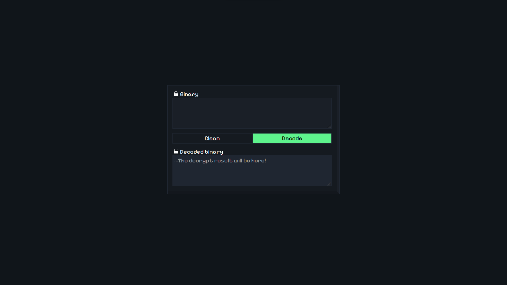

# 🧟 Decrypt
## 📚 Objective
the objective of this project is to increase my typescript abilities, and crate a useful tool for transcripition, i pretend to implement more ciphers along the time, for now just the binary cipher are avaliable!
## 🔨 Tools
- Typescript
- NextJs 14
- Vercel

## 🖼️ Project

### 🔗 <a src="https://decrypt-kappa.vercel.app/" >Link</a> 